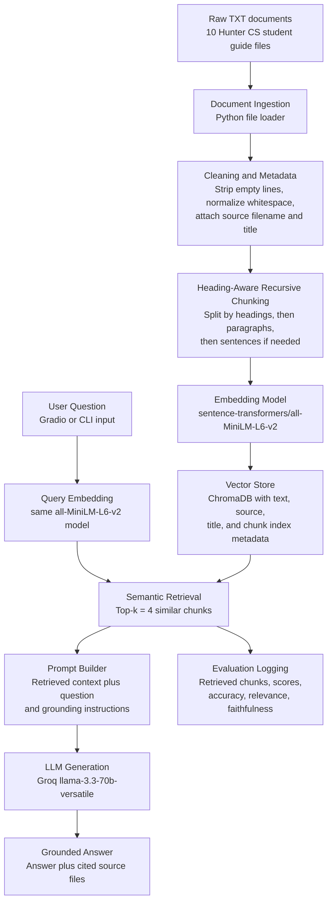

# Project 1 Planning: The Unofficial Guide

> Write this document before you write any pipeline code.
> Your spec and architecture diagram are what you'll use to direct AI tools (Claude, Copilot, etc.) to generate your implementation. The more specific they are, the more useful the generated code will be.
> Update the Retrieval Approach and Chunking Strategy sections if you change your approach during implementation.
> Update this file before starting any stretch features.

---

## Domain

I chose the domain of practical guidance and advice for Hunter College computer science students who are trying to succeed in the major, build projects, prepare for internships, and eventually land a career in tech or a tech-adjacent field. This knowledge is valuable because it is the type of advice students usually learn from clubs, upperclassmen, trial and error, and online communities rather than from official college pages alone. My guide focuses on making that advice searchable so students can ask questions like how to plan CS classes, when to start interview prep, how to build a resume, and what resources are worth using.

## Documents

| #   | Source                                                               | Description                                                                                                                                                                                                             | URL or location                                   |
| --- | -------------------------------------------------------------------- | ----------------------------------------------------------------------------------------------------------------------------------------------------------------------------------------------------------------------- | ------------------------------------------------- |
| 1   | Student-created club guide: Career Paths                             | Explains different computer science career paths and recommends roadmap.sh as a way to explore possible technical roles beyond only software engineering.                                                               | `documents/cs-club/career_paths.txt`                                |
| 2   | Student-created club guide: Create LinkedIn                          | Gives beginner-friendly advice on why Hunter CS students should make a LinkedIn profile, connect with students and professionals, and use the platform to learn about careers.                                          | `documents/cs-club/create_linkedin.txt`                             |
| 3   | Student-created club guide: Create Resume                            | Covers resume basics for students pursuing programming-related roles, including templates, ATS-friendly formatting, and how to add projects when they lack experience.                                                  | `documents/cs-club/create_resume.txt`                               |
| 4   | Student-created club guide: Internships                              | Explains why students should apply to internships even as lowerclassmen and points them toward internship lists and underclassman-focused programs.                                                                     | `documents/cs-club/internships.txt`                                 |
| 5   | Student-created club guide: Interview Prep                           | Gives an overview of the technical interview process, LeetCode, Grind 75, Tech Interview Handbook, and how Hunter courses like CSCI 235 and CSCI 335 connect to data structures and algorithms.                         | `documents/cs-club/interview_prep.txt`                              |
| 6   | Student-created club guide: Women in CS at Hunter                    | Gives advice for women and nonbinary CS students at Hunter about community, confidence, impostor syndrome, mentors, and outside communities like Rewriting the Code and Break Through Tech.                             | `documents/hunter_cs_extra_sources/women_in_cs_hunter.txt`                 |
| 7   | Student-created club guide: Hunter CS Course Planning                | Explains how Hunter CS students should think about course sequences, prerequisites, workload, DegreeWorks, and not overloading difficult CS and math classes.                                                           | `documents/hunter_cs_extra_sources/hunter_cs_course_planning.txt`          |
| 8   | Student-created club guide: Projects for Hunter CS Students          | Gives project ideas for beginner and intermediate Hunter CS students and explains how projects can become resume-worthy with GitHub, READMEs, demos, and clear impact.                                                  | `documents/hunter_cs_extra_sources/projects_for_hunter_cs_students.txt`    |
| 9   | Student-created club guide: Updated Interview Prep with NeetCode     | Updates the interview prep advice by focusing on NeetCode, coding patterns, weekly consistency, behavioral prep, and how interview preparation should change depending on where a student is in the Hunter CS sequence. | `documents/hunter_cs_extra_sources/neetcode_interview_prep.txt`            |
| 10  | Student-created club guide: Hackathons, Research, and CUNY Resources | Explains how Hunter CS students can use hackathons, research, CUNY Tech Prep, the Hunter Career Center, and other outside opportunities to build experience beyond classes.                                             | `documents/hunter_cs_extra_sources/hackathons_research_cuny_resources.txt` |

---

## Chunking Strategy

**Chunk size:** 300 to 450 words per chunk, with the chunker trying to split on section headings and paragraphs first. If a section is short, I will keep the whole section together. If a section is too long, I will split by paragraph and only fall back to sentence-level splitting if needed.

**Overlap:** About 50 to 75 words of overlap for chunks that are split from the same long section. I will use little or no overlap when a heading section is already short and self-contained because too much overlap could create duplicate chunks that retrieve the same information repeatedly.

**Heading detection (implementation note):** My source files use plain-text headings, not Markdown `#` markers. The first non-empty line of each file is the document title. A later line is treated as a section heading when it is short (roughly eight words or fewer), is preceded by a blank line, does not end with sentence punctuation (`. , ; :`), is not a numbered/bulleted list item, and is immediately followed by body text. Every chunk keeps its section heading at the top so the advice stays tied to its context, and very short sections are merged with an adjacent section in the same document so I do not emit fragments.

**Reasoning:** I will use a heading-aware recursive chunking strategy instead of simple fixed-size chunking. These documents are not huge PDFs or long textbooks. They are short student advice guides with clear headings such as “Why LinkedIn?”, “When Should I Start?”, “Beginner Project Ideas”, and “Final Takeaways.” Because of that, the best chunk is usually one complete section or a few related paragraphs, not a random number of characters. This follows the RAG lesson’s idea that chunks should be big enough to answer a question but small enough to stay focused. A full document chunk would be too broad because one guide may contain multiple topics, while tiny chunks would lose context like which resource or class the advice is referring to.

---

## Retrieval Approach

**Embedding model:** I will use `sentence-transformers/all-MiniLM-L6-v2` through the `sentence-transformers` library. This model is a good fit for a class project because it runs locally, does not require paid API credits, and produces dense embeddings that work well for semantic search over sentences and paragraphs.

**Top-k:** I will start with `top_k = 4`. This should give the LLM enough context to answer most student advice questions without flooding it with loosely related chunks. If early testing shows that answers are missing important context, I will try `top_k = 5`. If answers become too broad or mix unrelated advice from multiple documents, I will lower it back to 3 or improve chunking.

**Production tradeoff reflection:** In production, I would compare embedding models based on accuracy, latency, cost, maximum input length, and whether the model understands student slang, technical terms, and Hunter-specific language. For this project, a local embedding model is sensible because the corpus is small and the goal is to build the full RAG pipeline without spending money. If cost were not a constraint, I would consider a stronger hosted embedding model for better retrieval quality, but I would also need to think about privacy because these guides may include student-created advice. I would use ChromaDB as the vector store because it supports storing embeddings with document metadata, which is important for source attribution.

---

## Evaluation Plan

| #   | Question                                                                                                         | Expected answer                                                                                                                                                                                                                                                                                                                                        |
| --- | ---------------------------------------------------------------------------------------------------------------- | ------------------------------------------------------------------------------------------------------------------------------------------------------------------------------------------------------------------------------------------------------------------------------------------------------------------------------------------------------ |
| 1   | When should a Hunter CS student start seriously preparing for technical interviews?                              | The system should say that students can start lightly in CSCI 135 with basic arrays, strings, hash maps, and recursion, but should take interview prep more seriously around CSCI 235 because data structures connect directly to interviews. By CSCI 335 or after finishing it, consistent practice is recommended for internships or new grad roles. |
| 2   | What resource does the guide recommend for exploring different computer science career paths?                    | The system should identify roadmap.sh as the recommended resource and explain that it gives clear roadmaps for different developer career paths, helping students research what each path requires.                                                                                                                                                    |
| 3   | What should a Hunter CS student do if they have little or no programming experience for their resume?            | The system should say to list all experiences first, condense the resume to one page with the most relevant experiences, and add technical projects from class knowledge or personal interests to show coding ability.                                                                                                                                 |
| 4   | What advice does the guide give to women or nonbinary CS students who feel isolated in computer science classes? | The system should say that they are not behind and should not isolate themselves. It should recommend building community with classmates, upperclassmen, clubs, and outside communities like Rewriting the Code or Break Through Tech, while asking specific questions and finding mentors.                                                            |
| 5   | What should students do outside of classes to build experience as CS students?                                   | The system should mention projects, hackathons, research, CUNY Tech Prep, club work, internships, and career center resources. The expected answer should emphasize that classes alone are usually not enough and that students should commit to at least one experience outside class.                                                                |

---

## Anticipated Challenges

1. Some queries may retrieve advice from the wrong document because many guides share overlapping career vocabulary like “resume,” “internship,” “projects,” “interview,” and “technical skills.” For example, a question about projects could retrieve resume advice because both talk about making a student more employable. I will check this by printing retrieved chunks and their sources before adding generation.

2. The documents are written in a casual student-advice tone, so some answers may be subjective rather than factual. The system should be careful to say “the guide recommends” or “the documents suggest” instead of presenting advice as universal truth. Source attribution will be important because users should be able to see which guide the advice came from.

3. Chunk boundaries could split a heading from the paragraphs that explain it, especially in documents with short sections and lists. To reduce this risk, my chunker will preserve headings with the text that follows them and include metadata such as source filename and chunk index.

4. An out-of-scope question may cause hallucination if the prompt is too weak. For example, if a user asks for official graduation requirements or guaranteed internship outcomes, the system should say it does not have enough information instead of guessing from general knowledge.

---

## Architecture

---

## AI Tool Plan

**Milestone 3 — Ingestion and chunking:** I will use ChatGPT or Claude to help implement the ingestion and chunking script. I will give it my Documents table, Chunking Strategy section, and the Architecture diagram. I expect it to produce Python code that loads every `.txt` file from `data/raw`, cleans whitespace, preserves headings, attaches metadata, and creates chunks around 300 to 450 words with 50 to 75 words of overlap only when needed. I will verify the output by printing at least 5 random chunks and checking that each chunk is readable, substantive, self-contained, and tied to the correct source file.

**Milestone 4 — Embedding and retrieval:** I will use ChatGPT or Claude to help write the code for loading `sentence-transformers/all-MiniLM-L6-v2`, embedding all chunks, storing them in ChromaDB, and retrieving the top 4 chunks for a user query. I will give it the Retrieval Approach section and my chunk metadata format. I expect it to produce a retrieval function that returns chunk text, source filename, title, chunk index, and distance score. I will verify it by testing at least 3 evaluation questions before adding the LLM and checking whether the retrieved chunks actually answer the question.

**Milestone 5 — Generation and interface:** I will use ChatGPT or Claude to help connect retrieval to an LLM and build a simple Gradio interface. I will give it the Architecture diagram, the grounding requirement, and the expected response format. I expect it to produce code where the LLM answers only from retrieved context and says it does not have enough information when the documents do not answer the question. I will verify this by testing normal questions, checking that source files are visible in the output, and asking at least one out-of-scope question to confirm that the system refuses to guess.
